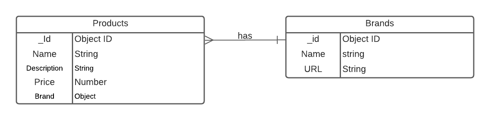
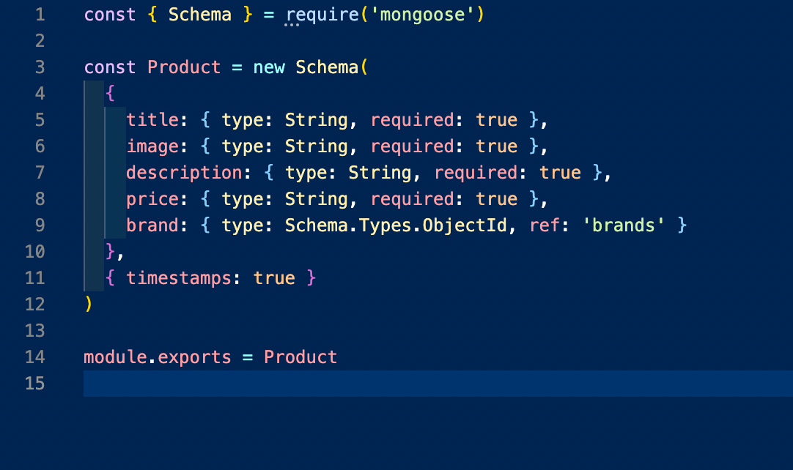

# My E-commerce Store
## By: Mustapfa Hydara
#
Ecommerce is the future of our economy. As an upcoming software engineer I want to show I can make a product for real world use.

# Technologies Used
<li>  <a href = "https://trello.com/b/BNq3IkjE/ecommerce-store">Trello </a>
<li>  <a href = "https://github.com/mhydara0624/Ecommercestore">GitHub </a>
<li> Lucid Chart
<li> Javascript
<li> CSS
<li> Bootstrap
<li> React
<li> MongoDB
<li> Mongoose
<li> Heroku

# Getting Started
This E-commerce store will be a full stack MERN application is depolyed on Heroku. This application will be a website with a store page displaying various electronics products along with their price and other information. The aim of this project was to be able to display 3 crud requests GET POST and DELETE. The GET is displayed This app is from an admin's view and they are able to import new products into the API and store page via the form. The GET request comes into play when displaying the store items in the database. The Delete function is with the delete list button.

# ERD
 

 # Component Diagram Tree
 

# Coding Structure
<details>
<summary> Back-End</summary>
<li> The Back-End process started with using mongoose with mongodb and setting up boilerplate as well as the schemas for my data. I used two schema but used mongoose associations with my brand schema so I could use it without repeating it over multiple products. I made sure to export both. 

<li> After setting up my two schema I decided to set up a seed file to give my application data to begin with. After completing this and seeding the data into my database I was ready to move on to express.
<li> Before setting up my express routes I set up my controllers so that I would be able to manipulate the data as needed. Below I have provided an example of my controllers with my POST request controller.

```javascript
const createProducts = async (req, res) => {
  try {
    const product = await new Product(req.body)
    await product.save()
    return res.status(201).json({
      product
    })
  } catch (error) {
    return res.status(500).json({ error: error.message })
  }
}
```
<li> The importance of controllers is dispalyed when you see how simple express routes become when you can just reference the controller function. After testing my routes on insomnia I was able to begin to move on to react. Below I have shown my express routes.

```javascript
const { Router } = require('express')
const router = Router()
const controllers = require('../controllers')

router.get('/', (req, res) => res.send('This is root!'))

router.get('/products', controllers.getAllProducts)

router.post('/products', controllers.createProducts)

router.delete('/products/:id', controllers.deleteProduct)

module.exports = router

```
</details>  

<details>
<summary> Front-End</summary>
<li> The front end react app was much more expansive than the backend. My front end applications currently utilizes 3 pages. A Home page, Store page, and Product Form page. These pages were made with 3 components. My Nav component, Product Card and Text Input component.
<li> Most of my logic was contained in my APP.js page. This is where i deployed the Use State and Use Effect react hooks to display my array of products on the store page. Below I will show how i was able to implement my GET request with the frontend.

```javascript
const [products, setProducts] = useState([])

 useEffect(() => {
    async function getProducts() {
      let res = await axios.get(`${BASE_URL}`)
      console.log(res.data)
      setProducts(res.data)
    }
    getProducts()
    return
  }, [])
```
<li> The post request was used along with a form to submit new products to be shown on the listings page. Below i will show how i implemented this.

```javascript
 const [newProduct, setNewProduct] = useState({
    title: '',
    image: '',
    description: '',
    price: '',
    brand: ''
  })

  const addProduct = async (req, res) => {
    res = await axios.post(`${BASE_URL}`, newProduct)
  }

```
<li> I also used a Delete request that went along with a function in my product card component. The onClick of the button on my product cards displayed in store should delete that listing.

```javascript
function ProductCard(props) {
  const { product } = props

  const deleteListing = () => {
    axios.delete(`http://localhost:3001/api/products/${props._id}`)
  }
  return (
    <Card style={{ width: '19rem' }}>
      <Card.Img variant="top" src={product.image} />
      <Card.Body>
        <Card.Title>{product.title}</Card.Title>
        <Card.Text> ${product.price} </Card.Text>
        <Card.Text>{product.description}</Card.Text>
        <Button onClick={deleteListing} variant="primary">
          Delete Listing
        </Button>
      </Card.Body>
    </Card>
  )
}
```
<li> In order to properly have my site function I needed to set up my browser router and make sure it was connecting and rendering the right pages. Below you will see how I went about doing that.

```javascript
 <div className="App">
      <header>
        <NavbarComp />
      </header>
      <main>
        <Switch>
          <Route exact path="/" component={Home} />
          <Route
            exact
            path="/store"
            component={(routerProps) => (
              <Store {...routerProps} products={products} />
            )}
          />
          <Route
            exact
            path="/admin"
            render={(props) => (
              <ProductForm
                newProduct={newProduct}
                handleChange={handleChange}
                addProduct={addProduct}
              />
            )}
          />
        </Switch>
      </main>
    </div>
  )
}

```
<li> Note to user that my product form page contains a list of acceptable brand codes. My brand key in my schema references the brand object id. In order to post new functions you must use one of the existing brands so I have posted them on the form page for ease of use.
</details> 


<details>
<summary> Styling</summary>
</details>  
 
 # Credits


 # Future Updates