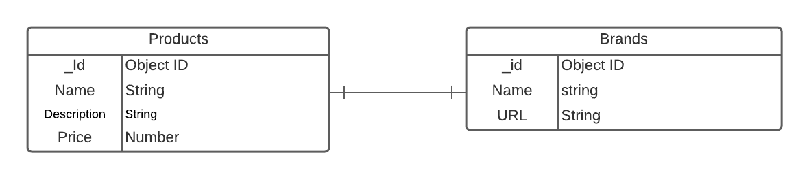
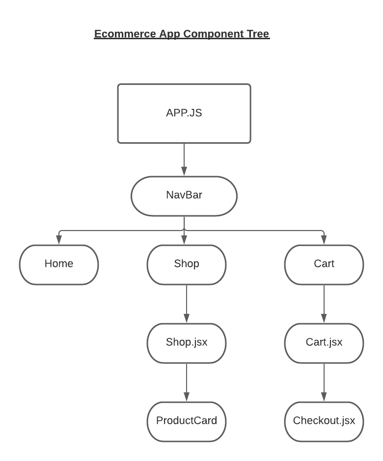

# My E-commerce Store
## By: Mustapfa Hydara
#
Ecommerce is the future of our economy. As an upcoming software engineer I want to show I can make a product for real world use.

# Technologies Used
<li>  <a href = "https://trello.com/b/BNq3IkjE/ecommerce-store">Trello </a>
<li>  <a href = "https://github.com/mhydara0624/Ecommercestore">GitHub </a>
<li> Lucid Chart
<li> Javascript
<li> CSS
<li> React
<li> MongoDB
<li> Mongoose
<li> Heroku

# Getting Started
This E-commerce store will be a full stack MERN application that will be depolyed on Heroku. This application will be a website with a store page displaying various products along with their price and other information. Clicking onto the add cart button will add the products to a functional shopping cart.

# ERD
 

 # Component Diagram Tree
 

# Coding Structure

 Back-End

  

 Front-End

  

 Styling

  
 
 # Credits

 # Future Updates